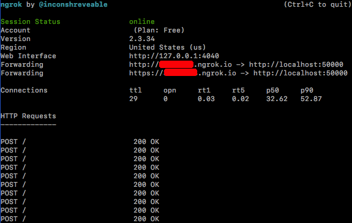
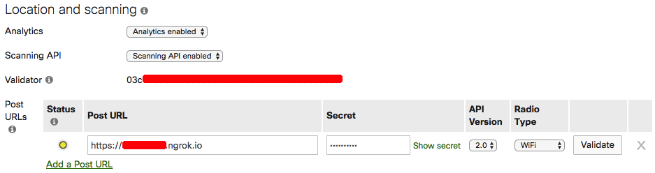

This is a Golang implementation of a [Cisco Meraki Scanning API receiver](https://developer.cisco.com/meraki/scanning-api/#!introduction/scanning-api). This server does not support HTTPS at this time, so it needs to be used in conjunction with a tool like [grok](https://ngrok.com/docs), which can used as the URL where the Cisco Meraki cloud will send the POSTs.

## Requirements

This requires the [gorilla/mux](https://github.com/gorilla/mux) package and was built with Mac OS go version go1.12.4. It will likely work on Linux OSs but it remains untested for the moment.


## Setup

1) Run ngrok on the same machine the HTTP POSTs are going to be received, with `ngrok http <port>`. The terminal window will look something like the screenshot below.



2) In the Cisco Meraki dashboard, configure the POST URL with the URL provided by ngrok, which may look something like `https://xxxxxx.ngrok.io`. With the free plan, ngrok will change this URL everytime it is started.




3) Download and run this script with
```
git clone https://github.com/DPinato/ScanningAPIReceiver.git
cd ScanningAPIReceiver
go run receiver.go --validator <str>
```

The validator string is a required argument and can be found in the Cisco Meraki dashboard Network-wide > General page.

## Notes
- receiver.go listens on TCP port 8080. Can be changed with `--port <n>` argument. This needs to match the port used by ngrok.
- The full content of the HTTP requests received is dumped to STDOUT and a log file "receiver.log". A different log file can be specified with `--logfile <path>`.


## Example commands
```
go run receiver.go --validator <str> --port <p>
go run receiver.go --validator <str> --port 50000 --logfile sample.log
```
